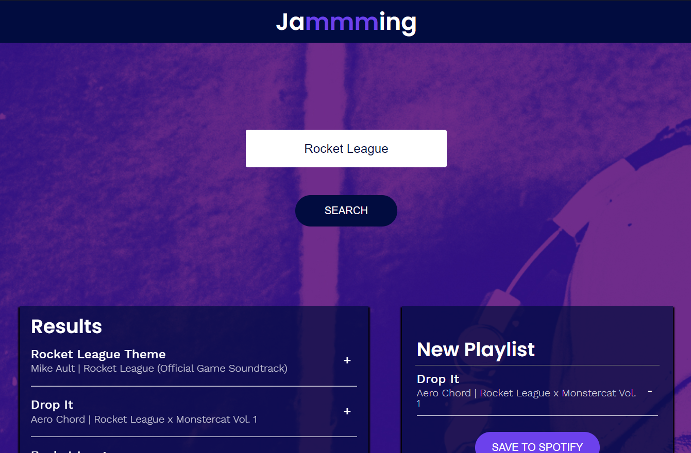

# jammming
> jammming is a Single Page Application (SPA) created with React, CSS3, and JavaScript. It was done using an outline from [Codecademy](https://www.codecademy.com). The website renders an application that hooks into the [Spotify Web API](https://developer.spotify.com/documentation/web-api/) to authenticate users, search for tracks, and save new playlists to a user's Spotify profile.

## Table of Contents
* [General Info](#general-info)
* [Screenshot and Instructions](#screenshot-and-instructions)
* [Technologies](#technologies)
* [Setup](#setup)
* [Features](#features)
* [Status](#status)

## General Info
This project was a capstone project for the Front-End Developer course at [Codecademy](https://www.codecademy.com). The entire application is made up of components that pass information to each other in the form of props. The images are provided by [Codecademy](https://www.codecademy.com).

## Screenshot


## Technologies
* React
* CSS3
* JavaScript

## Setup
The site is live [here](julmango-jam.surge.sh).

## Code Examples
Show examples of usage:
```javascript
class App extends React.Component {
  constructor(props){
    super(props);
    this.state = {
      searchResults: [],
      playlistName: "My Playlist",
      playlistTracks: []
     };
     
    this.addTrack = this.addTrack.bind(this);
    this.removeTrack = this.removeTrack.bind(this);
    this.updatePlaylistName = this.updatePlaylistName.bind(this);
    this.savePlaylist = this.savePlaylist.bind(this);
    this.search = this.search.bind(this);
  }
```
```javascript
class TrackList extends React.Component {
    render() {
        return (
            <div className='TrackList'>
                {this.props.tracks.map(track => {
                    return <Track key={track.id} track={track} isRemoval={this.props.isRemoval} onAdd={this.props.onAdd} onRemove={this.props.onRemove}/>
                })}
            </div>
        )
    }
}
```

## Features
* A Single Page Application (SPA) that doesn't need to reload the page to update information
* Authentication handled by Spotify for a secure connection
* Constructed using stateful and stateless components for easy debugging, scaling, and readability.

## Status
Project is: _finished_. If any updates are made, they will be cosmetic or refactoring changes.